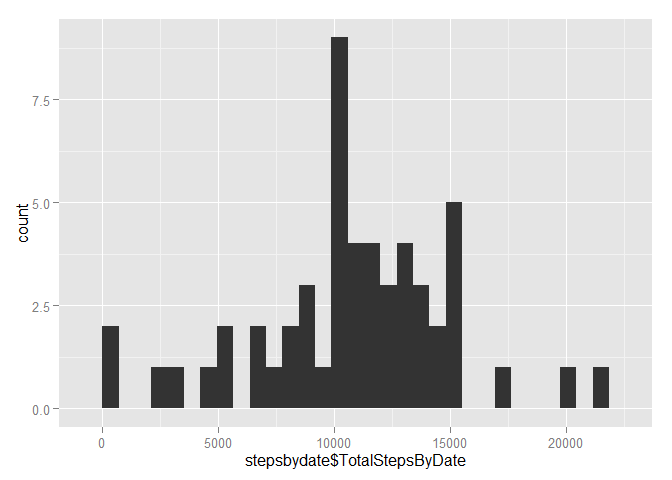

# Reproducible Research: Peer Assessment 1
CourseraStudent Pseudo1f  
Sunday, February 07, 2016  


## Loading and preprocessing the data
We're assuming that the data is unzipped into the working directory  
Now let's read everything and load libraries

```r
data <- read.csv("activity.csv")
library(plyr)
library(dplyr)
```

```
## 
## Attaching package: 'dplyr'
```

```
## The following objects are masked from 'package:plyr':
## 
##     arrange, count, desc, failwith, id, mutate, rename, summarise,
##     summarize
```

```
## The following objects are masked from 'package:stats':
## 
##     filter, lag
```

```
## The following objects are masked from 'package:base':
## 
##     intersect, setdiff, setequal, union
```

```r
library(ggplot2)
library(timeDate)
```


## What is mean total number of steps taken per day?
In Roger's words:  
"For this part of the assignment, you can ignore the missing values in the dataset.  
Make a histogram of the total number of steps taken each day  
Calculate and report the mean and median total number of steps taken per day"  
We're just going to do a simple group_by, summarize and then plot this

```r
data<-group_by(data, date)
stepsbydate <- summarize(data, TotalStepsByDate = sum(steps, na.rm=TRUE))
for (i in 1:nrow(stepsbydate)) {
     if (stepsbydate[i,2]==0) {
          stepsbydate[i,2]<-NA
     }
}
qplot(stepsbydate$TotalStepsByDate)
```

```
## stat_bin: binwidth defaulted to range/30. Use 'binwidth = x' to adjust this.
```

\

```r
mean(stepsbydate$TotalStepsByDate, na.rm=TRUE)
```

```
## [1] 10766.19
```

```r
median(stepsbydate$TotalStepsByDate, na.rm=TRUE)
```

```
## [1] 10765
```


## What is the average daily activity pattern?
In Roger's words:  
"Make a time series plot (i.e. type = "l") of the 5-minute interval (x-axis) and the average number of steps taken, averaged across all days (y-axis)  
Which 5-minute interval, on average across all the days in the dataset, contains the maximum number of steps?"  


```r
data<-group_by(data, interval)
stepsbyinterval <- summarize(data, AvgStepsByInterval = mean(steps, na.rm=T))
plot(stepsbyinterval$interval, stepsbyinterval$AvgStepsByInterval, type="l")
```

\

And here's the interval with the max steps:

```r
stepsbyinterval[stepsbyinterval$AvgStepsByInterval==max(stepsbyinterval$AvgStepsByInterval),1]
```

```
## Source: local data frame [1 x 1]
## 
##   interval
##      (int)
## 1      835
```
## Imputing missing values
"Note that there are a number of days/intervals where there are missing values (coded as NA). The presence of missing days may introduce bias into some calculations or summaries of the data.  

1. Calculate and report the total number of missing values in the dataset (i.e. the total number of rows with NAs)  
2. Devise a strategy for filling in all of the missing values in the dataset. The strategy does not need to be sophisticated. For example, you could use the mean/median for that day, or the mean for that 5-minute interval, etc.  
3. Create a new dataset that is equal to the original dataset but with the missing data filled in.  
4. Make a histogram of the total number of steps taken each day and Calculate and report the mean and median total number of steps taken per day. Do these values differ from the estimates from the first part of the assignment? What is the impact of imputing missing data on the estimates of the total daily number of steps?"  

Calculating total number of missing values is pretty straightforward  
Note that since there are no missing values under date nor interval then all we have to do is count the missing values under steps


```r
sum(is.na(data[,1]))
```

```
## [1] 2304
```
And now to fill in the missing data Ill simply used the mean of the available data for thatinterval

```r
for (i in 1:nrow(data)) {
     if (is.na(data[i,1])==TRUE) {
          data[i,1]<-stepsbyinterval[stepsbyinterval$interval==as.numeric(data[i,3]),2]
     }
}
data<-group_by(data, date)
stepsbydate <- summarize(data, TotalStepsByDate = sum(steps, na.rm=TRUE))
```
And for the histogram of the new data along with new mean and new median:

```r
qplot(stepsbydate$TotalStepsByDate)
```

```
## stat_bin: binwidth defaulted to range/30. Use 'binwidth = x' to adjust this.
```

\

```r
mean(stepsbydate$TotalStepsByDate)
```

```
## [1] 10766.19
```

```r
median(stepsbydate$TotalStepsByDate)
```

```
## [1] 10766.19
```
Note that the mean doesn't change which s expected since I just replaced missig values with the mean

## Are there differences in activity patterns between weekdays and weekends?
In Roger's words:  
"For this part the weekdays() function may be of some help here. Use the dataset with the filled-in missing values for this part.  
1. Create a new factor variable in the dataset with two levels - "weekday" and "weekend" indicating whether a given date is a weekday or weekend day.  
2. Make a panel plot containing a time series plot (i.e. type = "l") of the 5-minute interval (x-axis) and the average number of steps taken, averaged across all weekday days or weekend days (y-axis). "  


```r
data$date <- strptime(data$date,"%Y-%m-%d")
data <- transform(data, isweekend=(isWeekend(date)))
for (i in 1:nrow(data)) {
     if (data[i,4]==TRUE) {
          data[i,4] = "Weekend" 
     }
     else {
          data[i,4] = "Weekday"
     }
}
ggplot(data, aes(interval, steps))+stat_summary(fun.y=mean, geom="line")+facet_grid(isweekend~.)
```

\

Voila. We're done
